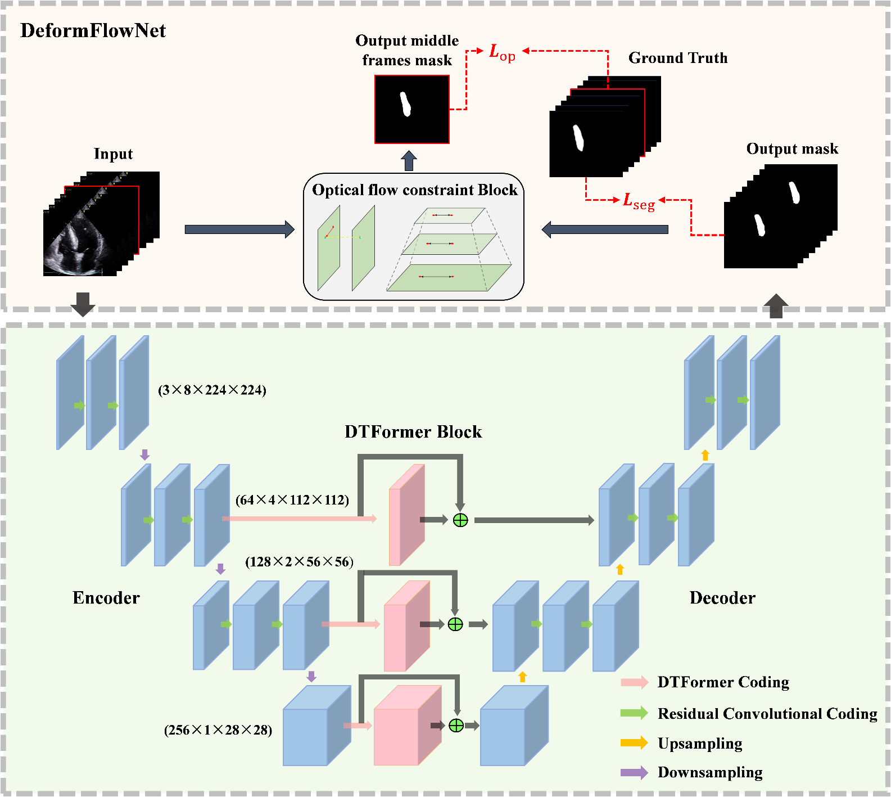
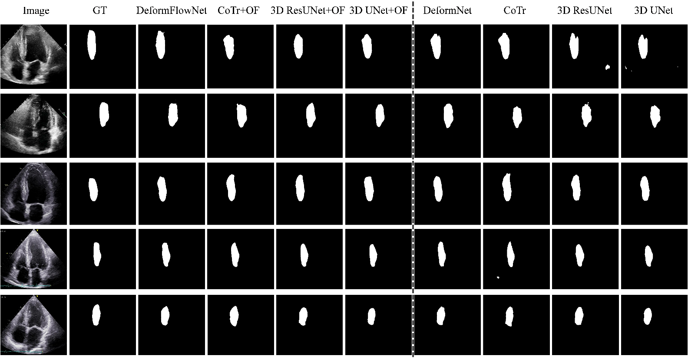

<div align="center">

# **D**eform**F**low**N**et: **A** **D**eformable **T**ransformer with **O**ptical **F**low **C**onstraint for **I**nterventricular **S**eptum **S**egmentation in **E**chocardiography **V**ideos

</div>

<div align="center">

## 🔥🔥🔥

#### Updated on Feb. 19, 2025

</div>

#### DeformFlowNet is a hybrid network designed for interventricular septum segmentation in transthoracic echocardiography (TTE) videos, combining U-shaped attention networks and optical flow constraints. It enhances segmentation accuracy by integrating a deformable transformer encoder and enforcing optical flow consistency across frames, achieving high segmentation performance!


<hr style=" height:2px;border:none;border-top:2px dotted #185598;" />

## ✨Paper

This repository provides the official implementation of DeformFlowNet Model.

**DeformFlowNet: A Deformable Transformer with Optical Flow Constraint for Interventricular Septum Segmentation in Echocardiography Videos** (Biomedical Signal Processing and Control, *Under Review*)

### Key Features

- The **Deformable Transformer (DTFormer)** Block integrates with skip connections in a U-shaped network to capture long-range dependencies and reduce computational complexity with deformable multi-head self-attention.
- The **Optical Flow Consistency Constraint** aligns the optical flow of TTE video frames with the decoder’s output mask sequence to refine segmentation accuracy and correct intermediate predictions.
- Joint Optimization with Hybrid Loss combines a U-shaped attention network loss and optical flow loss to enable robust training and improved segmentation performance through spatiotemporal feature integration.

</div>

## ✨Architecture of DeformFlowNet
The input ultrasound video frames are processed by a 3D ResUNet-based encoder for spatiotemporal feature extraction, enhanced by DTFormer blocks in skip-connections to capture long-range dependencies. The decoder up-samples features via transposed convolutions, and a motion-consistent optical flow module refines the middle frame mask using temporal motion information, producing a corrected segmentation mask.

<div align="center">



</div>


## ✨Dataset

|    |      Organ      |  Source | People |          Target             | Links                                                                                                |
|---:|:---------------:|:-------:|:------:|:---------------------------:|:----------------------------------------------------------------------------------------------------:|
|  1 |      Heart      | Private |   149  |   interventricular septum   | [Typical Samples](https://drive.google.com/file/d/13koYOx9ZU6A28ej4O_cq8MtB5Em02V6f/view?usp=sharing)|

## ✨Visualized segmentation effects between DeformFlowNet and different networks
Visualized interventricular septum segmentation effects between DeformFlowNet and different networks. The OF is the optical flow module, and adding “OF” to the model’s name means that the optical flow module is included in the model. Among them, DeformFlowNet proposed by us is DeformNet plus OF.

<div align="center">



</div>


## ✨File description and code description

### File description:

**checkpoints** # Hold models

**data** # Data sets used for model training, validation, and testing (3 typical samples)

| -- image # Enter the image

| -- label # Enter the label

| -- optical_flow # Input network optical flow matrix, calculated in advance

**infer** # Infer the interventricular septal region of other frames of the video using the trained model

**path** # Data path used for model training, testing, and validation

| -- train_3dflow_img_path_n8_g1.txt # Data path required for training

| -- val_3dflow_img_path_n8_g1.txt # Verify the desired data path

| -- test_3dflow_img_path_n8_g1.txt # Data path required for testing

(n8_g1 means select eight frames and the frame gap is 1)

**prediction** # Prediction visualization of the test set

| -- ourprosed_of #DeformFlowNet model proposed by us


### Code description:

**Creat_pathtxt.py** # data required to start the training path, output as "train_3dflow_img_path_n8_g1.txt", etc

**frame.py** # Video framing code

**opts.py** # Parameter Settings during training

**DeformFlowNet.py** # proposed the DeformFlowNet network

**sample3dflow.py** # Data processing and calculation of optical flow matrix before input to the network

**test3D_FLOW.py** # Test

**train3D_flow.py** # Training

## ✨Installation & Preliminary
1. Clone the repository.
    ```
    git clone https://github.com/treyguo15/DeformFlowNet.git
    cd DeformFlowNet
    ```
2. Create a virtual environment for DeformFlowNet and activate the environment.
    ```
    conda create -n DeformFlowNet python=3.9
    conda activate DeformFlowNet
    ```
3. Install Pytorch.
   (You can follow the instructions [here](https://pytorch.org/get-started/locally/))

5. Install other dependencies.
   ```
    pip install -r requirements.txt
   ```

## ✨Training and Testing the DeformFlowNet

1. Enter your python environment with the interpreter configured.

2. Train the DeformFlowNet with 3 typical samples provided by us or your own datasets. Complete model training and verification, and save the model
   ```
    python train3D_flow.py.py
   ```
3. Test the DeformFlowNet with 3 typical samples provided by us or your own datasets
   ```
    python test3D_FLOW.py.py
   ```

## ✨Download the best model's weights.
1. Download the [BestWeights](https://drive.google.com/file/d/1H7a7ZdhYSzb0dP5JQ1liHfmqL1VLOiCQ/view?usp=sharing) of the DeformFlowNet

